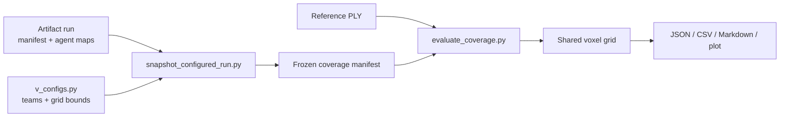

# Exploration Completion Utility — Explanation

This document describes the offline evaluator implemented in this directory.
The short [README](README.md) is the operational runbook; this file is the
calculation and data-contract reference.

## Purpose and scope

The utility compares one or more saved Bonxai occupancy maps with a reference
point cloud. It transforms both sources onto one discrete, world-aligned voxel
grid, then reports per-agent, swarm, and regional metrics.



This is a **reference-occupied-voxel comparison**:

- it is offline and does not publish ground truth or feed scores back into
  frontier planning;
- every unique reference voxel contributes once, regardless of raw point
  density;
- a reference voxel is not required to be a visible surface or reachable
  location; and
- it is not raw point-cloud percentage, explored free-space volume, bounding-box
  coverage, or proof that an agent physically visited a location.

## Project structure

```text
exploration_completion_utility/
├── resources/  default reference cloud and manual-run outputs
├── runs/       frozen snapshots created from artifact runs
├── src/        evaluator implementation
└── tests/      unit tests
```

`resources/virtualrun_2.ply` is the default reference cloud. Artifact-run
snapshots and their evaluation results belong in `runs/`. Map artifacts remain
owned by the ROS 2 run directory supplied to the snapshot command.

## Project components

| File | Responsibility |
|---|---|
| `src/snapshot_configured_run.py` | Selects artifact maps, resolves team/grid configuration, and writes a frozen evaluation manifest. |
| `src/evaluate_coverage.py` | Loads the manifest, builds voxel sets, evaluates regions, and prints the primary metrics. |
| `src/coverage.py` | Enforces grid alignment, creates tolerance neighbours, and calculates metrics. |
| `src/ground_truth.py` | Streams a binary PLY, applies its rigid transform, crops it, and voxelises it. |
| `src/report.py` | Writes JSON, CSV, Markdown, static plots, and the optional 3D viewer. |
| `tests/` | Unit tests for voxelisation, matching, snapshots, evaluation, and visualization helpers. |

## Inputs and frozen snapshots

### Artifact run

An artifact run normally lives under `flush_search/artifacts/<run_id>/`, or at
an explicitly supplied absolute path, and contains:

```text
<run_id>/
├── manifest.yaml
├── v_configs.py
├── inputs/
│   └── ...                         # other frozen runtime inputs
├── agent001_map.yaml
├── agent002_map.yaml
└── ...
```

The snapshot utility validates the artifact manifest, verifies the frozen
`v_configs.py` hash, and uses the manifest's resolved mission values. It does
not consult the mutable working-tree configuration. Selection is strict:

| Option | IDs | Selection |
|---|---|---|
| no option | — | Every available configured map |
| `--teams 0,1` | zero-based team IDs | Every configured member of each team; a missing member fails |
| `--agents 1,4,6` | one-based agent/map IDs | Exactly those maps; a missing map fails |

The source artifact run ID and the coverage snapshot ID are different. The
snapshot ID is the output directory and manifest `run_id`; it defaults to
`<artifact_run_id>_coverage`. Reusing an existing snapshot directory fails so
that a frozen analysis is not overwritten; use a new `--run-id` for another
snapshot, or evaluate the existing manifest directly.

The source artifact already owns the exact mission configuration and resolved
mission values. The snapshot records the selected maps, source artifact
manifest, team membership, ordered grid sequences, resolved grid bounds, and
region unions. It also copies the artifact's frozen mission configuration to
`<snapshot>/v_configs.py` for audit. Later evaluation reads the frozen coverage
manifest. Maps are referenced in place by default; `--copy-maps` copies them
into the snapshot.

The evaluator's default reference cloud is `resources/virtualrun_2.ply`; a
different cloud can be supplied with `--ground-truth`. `--mission-config` is
only a compatibility input for legacy artifacts and cannot override a frozen
artifact manifest.

### Evaluation manifest

The manifest fixes the values needed for a reproducible comparison:

| Field | Use |
|---|---|
| `evaluation.frame_id` | Required Bonxai map frame, normally `map`. |
| `evaluation.voxel_size_m` | Shared evaluation and Bonxai voxel size. |
| `evaluation.match_tolerance_m` | Maximum voxel-centre distance for a match. |
| `evaluation.bounds` | Overall metric-space crop. |
| `evaluation.regions` | Named rectangular regions. |
| `evaluation.region_unions` | Exact unions of named regions. |
| `evaluation.primary_region` | Region shown in the CLI and Markdown summary. |
| `ground_truth_transform` | PLY translation and quaternion into the map frame. |

The snapshot currently sets `primary_region` to
`configured_grid_footprint`, the exact set union of configured frontier grids.
It does not fill gaps inside the union's enclosing rectangle. Each grid and
each team footprint is also available as a named region.

## Calculation pipeline

### 1. Ground-truth reference voxels

The loader accepts binary little-endian or big-endian PLY files with a vertex
element containing `x`, `y`, and `z` properties. It processes vertices in
chunks, so the entire raw cloud is not copied into one transformed array.

For each vertex `p`:

1. Apply the manifest's rigid transform. The quaternion is normalized before it
   is converted to a rotation matrix:

   ```text
   p_map = R(quaternion) · p + translation
   ```

2. Keep only points inside the overall evaluation bounds:

   ```text
   lower <= p_map < upper
   ```

3. Quantise the point using the shared evaluation origin `o` and voxel size
   `s`:

   ```text
   k_GT = floor((p_map - o) / s)
   ```

4. Insert the integer key `k_GT` into a set.

The resulting set `G` contains one key per unique reference voxel. There is no
mesh reconstruction, normal estimation, ray casting, or inside/outside test.
Consequently, interior points and points behind walls count if they are present
in the input cloud.

### 2. Bonxai map voxels

Each saved map is loaded through the shared Bonxai YAML loader. Active cells are
classified as `free`, `occupied`, or `unknown`.

- Only `occupied` cells enter occupied-voxel recall, precision, and F1.
- `free` cells are retained for known-voxel and conflict diagnostics.
- `unknown` cells enter neither set.
- The evaluator uses each cell's discrete `map_index`, not a floating-point
  re-quantisation of its serialized metric position.

For a source map with origin `o_map`, source index `k_map`, and resolution `s`,
the aligned evaluation key is:

```text
k_eval = k_map + (o_map - o) / s
```

The offset must be an exact integer number of voxels, within the implementation's
numeric tolerance. The Bonxai resolution must equal the evaluation voxel size.
These checks preserve adjacent cells that could otherwise collapse through
floating-point re-quantisation.

Every agent's occupied and free keys are then cropped to the evaluation bounds
and deduplicated.

#### Map parsing cache

The first evaluation parses each YAML map and writes a NumPy `.npz` cache under
`results/cache/`. A later evaluation using the same output directory loads the
cache when it is at least as new as its source YAML. Editing a source map makes
that cache stale and triggers a rebuild; `--rebuild-cache` forces a rebuild.
Snapshot creation without `--evaluate` does not parse maps or create caches.

### 3. Region filtering

Regions are evaluated after the overall crop. A voxel belongs to a rectangular
region when its voxel centre is inside the region's half-open bounds:

```text
centre(k) = o + (k + 0.5) × s
lower <= centre(k) < upper
```

For a `region_unions` entry, the evaluator filters against every member region
and unions the resulting key sets. Overlapping members therefore count a voxel
once; gaps remain gaps.

Each region gets its own ground-truth denominator and map sets. Regional scores
are not averages of other regional scores.

### 4. Tolerance matching

Let `τ` be `match_tolerance_m`. The evaluator constructs the integer offset set:

```text
D = { d ∈ Z³ : ||d||₂ × s <= τ }
```

For source set `A` and target set `B`, define:

```text
M(A, B) = { a ∈ A : a + d ∈ B for at least one d ∈ D }
```

The matching is deterministic and neighbourhood-based, not a one-to-one
assignment. Several source voxels may match the same target voxel, while each
source voxel contributes at most once.

With the current defaults `s = 0.2 m` and `τ = 0.3 m`, the accepted offsets are
the same voxel, face neighbours, and two-axis diagonal neighbours:

| Offset type | Centre distance | Match? |
|---|---:|---|
| Same voxel | `0.000 m` | Yes |
| Face neighbour | `0.200 m` | Yes |
| Two-axis diagonal | `√2 × 0.2 ≈ 0.283 m` | Yes |
| Three-axis diagonal | `√3 × 0.2 ≈ 0.346 m` | No |

The same tolerance is used in both directions: reference-to-map for recall and
map-to-reference for precision.

## Metric definitions

For one region, define:

```text
G       = ground-truth reference voxels
O_i     = occupied voxels from agent i
F_i     = free voxels from agent i
O       = union of all O_i
F       = union of all F_i
K       = O union F
C       = O intersection F
```

### Occupied-voxel recall

```text
matched_ground_truth_voxels = |M(G, O)|
recall = |M(G, O)| / |G|
```

Recall answers: “What fraction of the reference geometry has a nearby occupied
voxel in at least one evaluated map?” It is the primary completion measure.

### Occupied-voxel precision

```text
matched_occupied_voxels = |M(O, G)|
precision = |M(O, G)| / |O|
```

Precision answers: “What fraction of the swarm's occupied voxels agree with the
reference?” Extra occupied voxels can reduce precision without changing recall.

### Occupied-voxel F1

```text
f1 = 2 × precision × recall / (precision + recall)
```

If both precision and recall are zero, F1 is reported as zero. F1 is a balance
score; recall remains the headline result because the utility measures
exploration completion.

### Swarm improvement over the best agent

Each agent is evaluated independently against the same `G`, tolerance, and
region. The swarm uses the occupied union `O`.

```text
best_agent_recall = max(recall_i)
improvement_over_best_agent = swarm_recall - best_agent_recall
```

The JSON stores the difference as a ratio. Human-readable reports format it as
percentage points (`pp`). For example, `0.1149` is `11.49 pp`, not a relative
11.49% increase. It measures complementary mapped reference voxels, not time,
distance, or flight efficiency.

### Per-agent diagnostics

For agent `i`, let `O_-i` be the union of every other agent's occupied set.

| Field | Calculation / meaning |
|---|---|
| `unique_contribution_voxels` | `|M(G, O)| − |M(G, O_-i)|`; reference voxels that become unmatched when agent `i` is removed. |
| `overlap_occupied_voxels` | `|O_i ∩ O_-i|`; exact shared voxel keys, without tolerance expansion. |
| `known_voxels` | `|O_i ∪ F_i|`. |
| `free_voxels` | `|F_i|`. |

Unique contribution is a matched-reference count, not the number of occupied
cells that only appear in one map. Overlap is an exact key intersection, so it
is intentionally stricter than metric matching.

### Known voxels and classification conflicts

For the swarm:

```text
known_voxels = |O union F|
classification_conflicts = |O intersection F|
classification_conflict_fraction = classification_conflicts / known_voxels
```

A conflict means that at least one agent marked the same aligned voxel occupied
and at least one agent marked it free. The conflicted voxel remains in `O` for
occupied-voxel scoring because an occupied observation exists.

Conflict is not the same as a false positive:

- conflict compares agent classifications with each other;
- precision compares occupied map voxels with the reference cloud.

Possible causes include pose alignment, sensor noise, map boundaries, and
different observations by different agents. Interpret the count with voxel size,
tolerance, and known-voxel count.

## Outputs

An evaluated snapshot writes:

```text
results/
├── cache/                    # Regenerable Bonxai parse caches
├── coverage_summary.json     # Counts, ratios, configuration, and every region
├── agent_metrics.csv         # One row per agent and region
├── region_metrics.csv        # Swarm metrics per region
├── coverage_summary.md       # Human-readable primary-region summary
└── plots/
    └── coverage_top_down.png # Green/red reference voxels with grid outlines and IDs
```

The static top-down plot overlays the frozen rectangular grid bounds and labels
each grid ID across the reference voxels. The optional interactive viewer shows
the agent occupied union, all reference
voxels, and missed reference voxels as independently toggleable layers. It
requires a graphical interactive Matplotlib backend; use `--no-vis` for
unattended runs.

## Reproducibility and failure policy

The following all affect the result and should be kept fixed when comparing
runs:

- reference PLY and its transform;
- frame ID, voxel size, and match tolerance;
- overall bounds and named region definitions; and
- selected maps and their source artifact.

The evaluator fails fast on missing inputs, invalid bounds, empty regions,
frame mismatches, duplicate map indices, differing map resolutions, or
non-integer origin alignment. It does not silently resample or guess a
replacement configuration.
